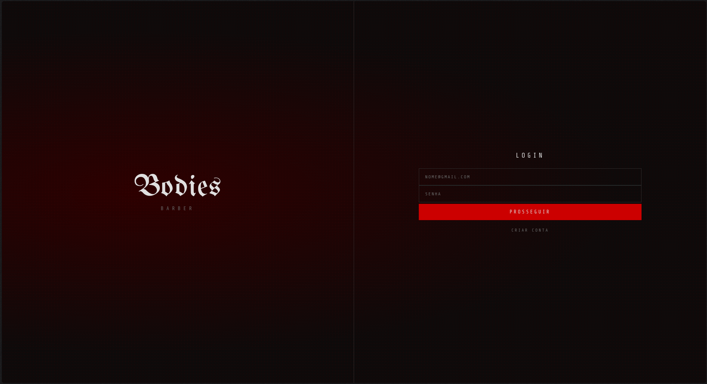
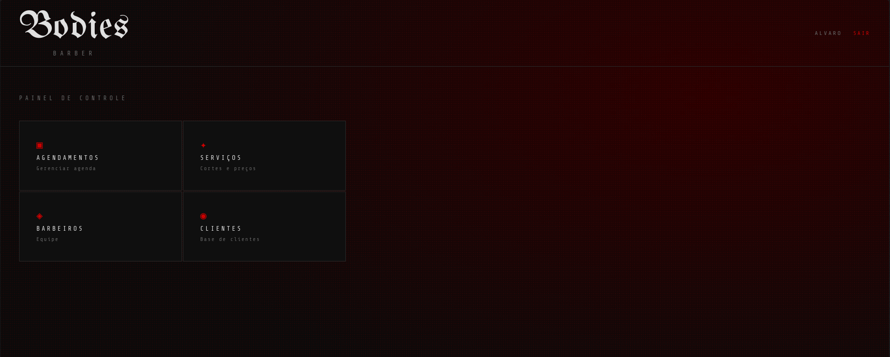
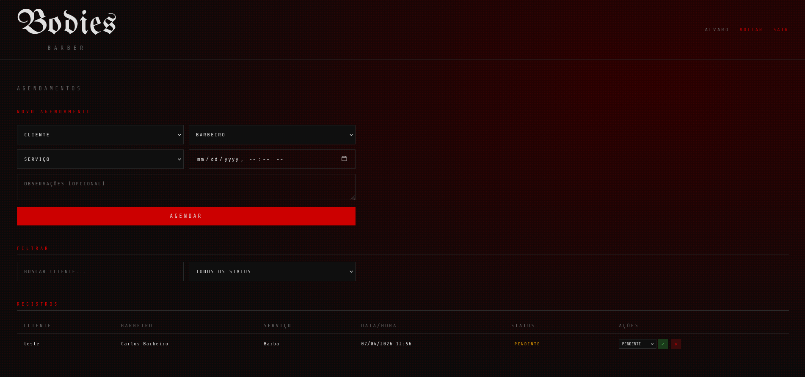

# Bodies Barber — Sistema de Agendamento
 


 
> Sistema de gerenciamento de agendamentos para barbearia desenvolvido com Flask e PostgreSQL, com interface brutalista de estética horror. Projeto da disciplina de Banco de Dados (2ª Nota) — UNIFSA, sob orientação do Prof. Anderson Costa.
 
---
 
## Prints da Aplicação
 
> *(adicione os prints na pasta `/docs` e descomente as linhas abaixo)*
 
<!--



-->
 
---
 
## Funcionalidades
 
- Login seguro com hash de senha (SHA-256)
- CRUD completo de agendamentos, serviços, barbeiros e clientes
- **INNER JOIN** — listagem de agendamentos com dados de cliente, barbeiro e serviço
- **LEFT JOIN** — barbeiros e clientes listados com total de agendamentos, mesmo sem nenhum
- Filtro e ordenação de agendamentos por cliente e status
- Controle de acesso por perfil (`admin`, `barbeiro`, `cliente`)
---
 
## Modelagem do Banco
 
Três tabelas relacionadas construídas no PostgreSQL:
 
| Tabela | Descrição |
|---|---|
| `usuarios` | Armazena clientes, barbeiros e administradores |
| `servicos` | Catálogo de serviços com preço e duração |
| `agendamentos` | Tabela central que conecta clientes, barbeiros e serviços |
 
Consulte [`/diagrama`](./diagrama/) para o Diagrama Entidade-Relacionamento completo.
 
---
 
## Estrutura do Repositório
 
| Pasta | Conteúdo |
|---|---|
| `/diagrama` | Diagrama Entidade-Relacionamento (PDF) |
| `/ddl` | Script SQL de criação das tabelas com PKs e FKs |
| `/dml` | Scripts SQL com exemplos de inserção, atualização e exclusão |
| `/dql` | Consultas SQL utilizadas no sistema (JOINs, filtros, ordenação) |
| `/src` | Código-fonte da aplicação (Python/Flask) |
 
---
 
## Como Executar
 
### Pré-requisitos
 
- Python 3.10+
- PostgreSQL rodando localmente
- pgAdmin (opcional)
### 1. Clone o repositório
 
```bash
git clone https://github.com/JeytheJo/SistemaCRUD_Barbearia.git
cd SistemaCRUD_Barbearia
```
 
### 2. Configure o banco de dados
 
Abra o pgAdmin e execute o script DDL para criar as tabelas:
 
```
ddl/databasePGSQL.sql
```
 
Opcionalmente, popule com dados de exemplo:
 
```
dml/inserts.sql
```
 
### 3. Configure o ambiente
 
Dentro de `/src`, crie um arquivo `.env`:
 
```env
DB_HOST=localhost
DB_PORT=5432
DB_NAME=CRUD_Barbearia
DB_USER=postgres
DB_PASSWORD=sua_senha
```
 
### 4. Instale as dependências
 
```bash
pip install flask psycopg2-binary python-dotenv
```
 
### 5. Execute
 
```bash
cd src
python app.py
```
 
Acesse em **http://127.0.0.1:5000**
 
### Credenciais de teste
 
| E-mail | Senha | Perfil |
|---|---|---|
| admin@bodies.com | senha123 | admin |
| carlos@bodies.com | senha123 | barbeiro |
 
---
 
## Vídeo Demonstrativo
 
🎥 *(Ainda vou gravar. )* 🫩
 
---
 
## Autor
 
**João Eduardo** — [@JeytheJo](https://github.com/JeytheJo)
 
UNIFSA — Disciplina de Banco de Dados — 2026
