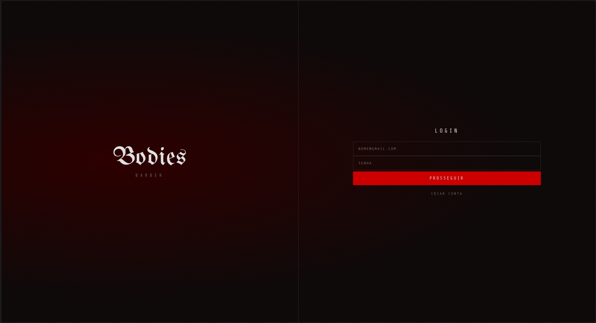
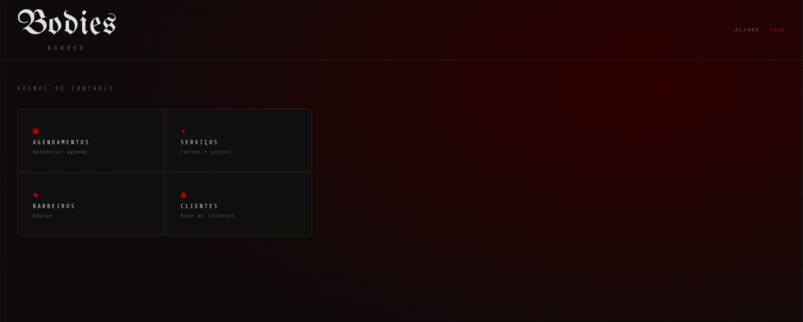
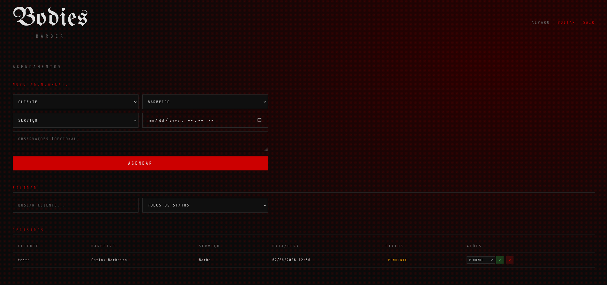
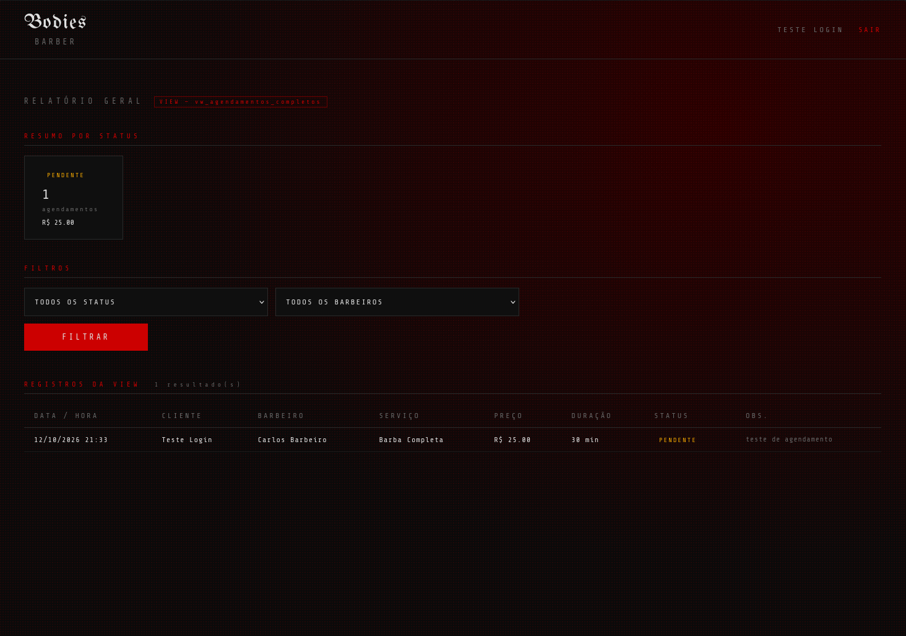
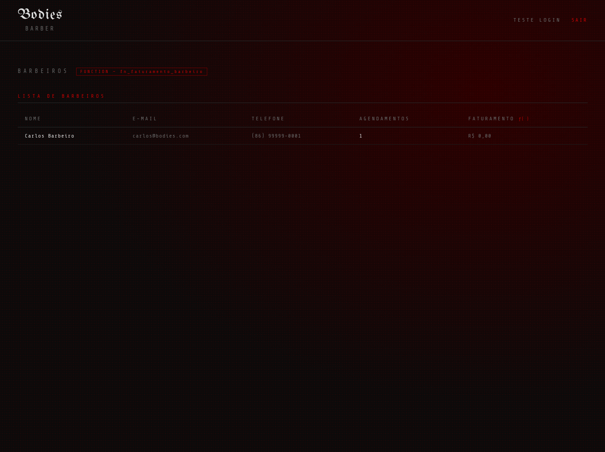

# Sistema de Agendamento para Barbearia — Bodies Barber

Projeto prático da disciplina de **Banco de Dados (2ª Nota)** — Centro Universitário Santo Agostinho (UNIFSA).

Demonstra integração Python + PostgreSQL com operações CRUD, consultas com JOIN, além de **VIEW**, **FUNCTION** e **PROCEDURE** implementadas no banco.

---

## 🌐 Acesso Online

> **O sistema está publicado e pode ser acessado diretamente pelo navegador, sem instalação.**

[](https://sistemacrud-barbearia.onrender.com)

### 🔑 Credenciais de Teste

| E-mail | Senha | Perfil |
|---|---|---|
| admin@bodies.com | senha123 | admin |
| carlos@bodies.com | senha123 | barbeiro |

> ⚠️ O serviço está hospedado no plano gratuito do Render — pode demorar ~30s para carregar na primeira visita (cold start).

---

## 🛠️ Tecnologias


| Camada | Tecnologia |
|---|---|
| Backend | Python 3 + Flask |
| Banco de dados | PostgreSQL 17 (Supabase) |
| Driver | psycopg2 |
| Interface | Web (Flask + HTML/CSS) |
| Deploy | Render (gunicorn) |

---

## 📂 Estrutura

```
SistemaCRUD_Barbearia/
├── database/
│   ├── views/       vw_agendamentos_completos.sql
│   ├── functions/   fn_faturamento_barbeiro.sql
│   └── procedures/  sp_confirmar_agendamento.sql
├── ddl/             databasePGSQL.sql
├── dml/             inserts.sql
├── dql/             queries.sql
├── docs/            prints do sistema
└── src/
    ├── app.py
    ├── database.py
    ├── requirements.txt
    ├── templates/
    └── static/
```

---

## 🗄️ Recursos Avançados do Banco

### VIEW — `vw_agendamentos_completos`
Consolida agendamentos, clientes, barbeiros e serviços em uma única consulta. Usada na rota `/relatorio`.

```sql
SELECT * FROM vw_agendamentos_completos;
```

### FUNCTION — `fn_faturamento_barbeiro(uuid)`
Retorna o total faturado por um barbeiro (agendamentos com status `concluido`). Usada na rota `/barbeiros`.

```sql
SELECT fn_faturamento_barbeiro('<uuid do barbeiro>');
```

### PROCEDURE — `sp_confirmar_agendamento(uuid)`
Confirma um agendamento pendente com segurança. Chamada ao confirmar agendamentos na rota `/agendamentos`.

```sql
CALL sp_confirmar_agendamento('<uuid do agendamento>');
```

---

## 🚀 Como Executar Localmente (sem Docker)

**Pré-requisitos:** Python 3.10 ou superior instalado.

### 1. Clone o repositório
```bash
git clone https://github.com/JeytheJo/SistemaCRUD_Barbearia.git
cd SistemaCRUD_Barbearia
```

### 2. Instale as dependências
```bash
pip install flask psycopg2-binary python-dotenv
```

> No Linux/Fedora, se necessário: `pip install --break-system-packages flask psycopg2-binary python-dotenv`

### 3. Configure o banco de dados

Crie o arquivo `src/.env` com as credenciais do Supabase:

```env
DB_HOST=db.XXXXXXXXXXXXXXXX.supabase.co
DB_PORT=5432
DB_NAME=postgres
DB_USER=postgres
DB_PASSWORD=sua_senha_aqui
```

> As credenciais completas estão em: **Supabase → Settings → Database → Connection parameters**

### 4. Execute

```bash
cd src
python app.py
```

### 5. Acesse no navegador

```
http://127.0.0.1:5000
```

---

## 📸 Telas do Sistema

### Login


### Dashboard


### Agendamentos (CRUD + PROCEDURE)


### Relatório (VIEW)


### Barbeiros (FUNCTION)


---

## 📺 Vídeo Demonstrativo

👉 

---

## 👤 Autor

**João Eduardo** — [@JeytheJo](https://github.com/JeytheJo)  
Centro Universitário Santo Agostinho — UNIFSA  
Disciplina: Banco de Dados — Prof. Anderson Costa